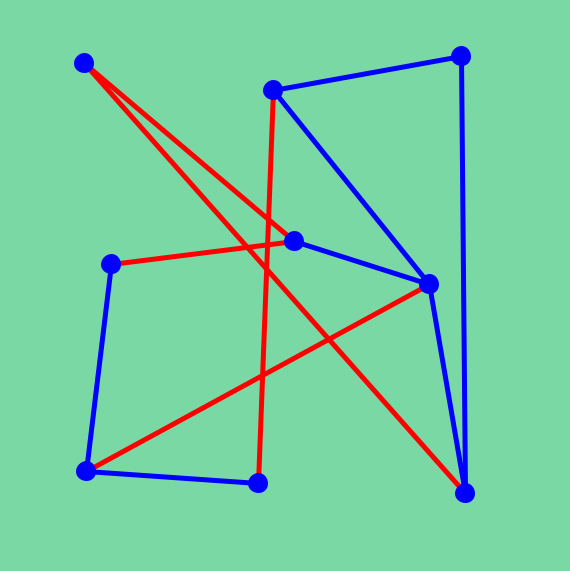

# Bling

## Description
A game in which a player's goal is to untangle a bunch of tangled wires. Inspired by Blingtron mini-game in World of Warcraft.

## Requirements
[Processing](https://processing.org) is required.

## Quick start
1. Open Processing IDE.
2. Open `bling.pde`.
3. Run the game.

## How to play
Using mouse, swap a pairs of circles in order to remove intersections between the lines. The goal of a level is to remove all line intersections.
